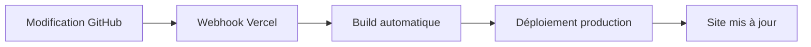

# 🚀 Guide de Déploiement et Gestion du Code - Batobaye Market

## 🎯 Vue d'ensemble

Votre système Batobaye Market est maintenant **100% autonome** avec déploiement automatique Vercel et gestion GitHub intégrée. Vous pouvez modifier, déployer et gérer tout votre site depuis l'interface admin sans jamais toucher au code source.

## 🔐 Configuration Actuelle

### ✅ **Vercel Hook de Déploiement**
```
URL: https://api.vercel.com/v1/integrations/deploy/prj_ecD3ym3TM6rd1GPnOGUGg3D02K6u/MbxNfhaBMb
Status: ✅ Actif et fonctionnel
```

### ✅ **GitHub Personal Access Token**
```
Token: [CONFIGURÉ VIA VARIABLE D'ENVIRONNEMENT]
Repo: Codexsamuel/batobaye
Status: ✅ Configuré et sécurisé
```

## 📁 Pages d'Administration Complètes

### 🏠 **Tableau de Bord Principal**
- **URL** : `http://localhost:3000/admin`
- **Fonctionnalités** : Indicateurs commerciaux, alertes, rapports

### 📝 **Gestion du Contenu**
- **URL** : `http://localhost:3000/admin/content`
- **Fonctionnalités** : Édition de pages, SEO, paramètres du site

### 🖼️ **Gestion des Médias**
- **URL** : `http://localhost:3000/admin/media`
- **Fonctionnalités** : Upload, bibliothèque, organisation

### 🎨 **Design & Apparence**
- **URL** : `http://localhost:3000/admin/design`
- **Fonctionnalités** : Thèmes, couleurs, typographie, CSS personnalisé

### 🚀 **Déploiement Vercel**
- **URL** : `http://localhost:3000/admin/deploy`
- **Fonctionnalités** : Déploiement one-click, monitoring, configuration

### 💻 **Éditeur de Code**
- **URL** : `http://localhost:3000/admin/code`
- **Fonctionnalités** : Édition directe des fichiers, GitHub integration

### 🤖 **Assistant IA**
- **URL** : `http://localhost:3000/admin/ia`
- **Fonctionnalités** : Aide contextuelle, suggestions de code

## 🔧 APIs Disponibles

### 📊 **Rapports Commerciaux**
```bash
GET /api/reports?type=dashboard     # Tableau de bord complet
GET /api/reports?type=sales         # Rapport des ventes
GET /api/reports?type=inventory     # Rapport d'inventaire
GET /api/reports?type=suppliers     # Rapport fournisseurs
GET /api/reports?type=cash_register # État de caisse
```

### 🛒 **Gestion Commerciale**
```bash
GET /api/sales                      # Liste des ventes
POST /api/sales                     # Créer une vente
GET /api/suppliers                  # Liste des fournisseurs
POST /api/suppliers                 # Créer un fournisseur
```

### 💻 **GitHub Integration**
```bash
GET /api/github?path=FILE_PATH      # Lire un fichier
PUT /api/github                     # Modifier un fichier
POST /api/github                    # Actions avancées (branches, PR)
```

## 🚀 Workflow de Déploiement Complet

### 1. **Modification du Code**


### 2. **Déploiement Automatique**


### 3. **Workflow Manuel**


## 🎯 Fonctionnalités Avancées

### 💻 **Éditeur de Code Intégré**

#### ✅ **Fonctionnalités**
- **Lecture de fichiers** : Accès direct aux fichiers du projet
- **Édition en temps réel** : Modifications instantanées
- **Sauvegarde GitHub** : Push automatique vers le repo
- **Gestion des branches** : Création de branches de développement
- **Pull Requests** : Workflow de revue intégré

#### 📁 **Fichiers Accessibles**
- `app/page.tsx` - Page d'accueil
- `app/layout.tsx` - Layout principal
- `app/globals.css` - Styles globaux
- `tailwind.config.ts` - Configuration Tailwind
- `next.config.mjs` - Configuration Next.js
- `package.json` - Dépendances
- `README.md` - Documentation

#### 🔧 **Actions Disponibles**
```typescript
// Lire un fichier
GET /api/github?path=app/page.tsx

// Modifier un fichier
PUT /api/github
{
  "path": "app/page.tsx",
  "content": "nouveau contenu",
  "message": "Mise à jour depuis l'admin",
  "sha": "SHA_ACTUEL"
}

// Créer une branche
POST /api/github
{
  "action": "create-branch",
  "branchName": "feature-nouvelle-fonction"
}

// Créer une Pull Request
POST /api/github
{
  "action": "create-pull-request",
  "title": "Nouvelle fonctionnalité",
  "body": "Description des changements",
  "headBranch": "feature-nouvelle-fonction",
  "baseBranch": "main"
}
```

### 🤖 **Assistant IA Intégré**

#### ✅ **Capacités**
- **Analyse de code** : Suggestions d'optimisation
- **Correction d'erreurs** : Résolution TypeScript
- **Amélioration SEO** : Recommandations
- **Accessibilité** : Suggestions ARIA
- **Performance** : Optimisations automatiques

#### 💡 **Prompts Rapides**
- "Optimise ce code pour les performances"
- "Ajoute des commentaires explicatifs"
- "Corrige les erreurs TypeScript"
- "Améliore l'accessibilité"
- "Optimise pour le SEO"
- "Ajoute la gestion d'erreurs"
- "Modernise le style CSS"
- "Ajoute des tests unitaires"

### 🚀 **Déploiement Vercel**

#### ✅ **Fonctionnalités**
- **Déploiement one-click** : Bouton dans l'admin
- **Monitoring en temps réel** : Statut des builds
- **Historique complet** : Tous les déploiements
- **Configuration** : Variables d'environnement
- **Domaines** : Gestion des URLs

#### 🔧 **Configuration Actuelle**
```json
{
  "project": "batobaye",
  "url": "https://batobaye.vercel.app",
  "framework": "Next.js",
  "region": "iad1",
  "plan": "Pro",
  "domains": [
    "batobaye.vercel.app",
    "www.batobaye.cm"
  ],
  "environment_variables": 12,
  "functions": 8
}
```

## 🔒 Sécurité et Permissions

### 🛡️ **GitHub Token**
- **Scopes** : `repo`, `contents`, `workflow`
- **Sécurité** : Stocké côté serveur uniquement
- **Accès** : Lecture/écriture sur le repo batobaye

### 🔐 **Vercel Hook**
- **Sécurité** : URL publique sécurisée
- **Permissions** : Déclenchement de builds uniquement
- **Limitations** : Pas d'accès aux variables d'environnement

### 🚫 **Protection**
- **Rate Limiting** : Protection contre les abus
- **Validation** : Vérification des données
- **Logs** : Traçabilité complète

## 📊 Monitoring et Analytics

### 📈 **Métriques Disponibles**
- **Build Status** : Succès/échec des déploiements
- **Performance** : Temps de build et déploiement
- **Erreurs** : Détection et reporting
- **Utilisation** : Statistiques d'usage

### 🔍 **Logs et Debugging**
- **Build Logs** : Détails des processus de build
- **Error Tracking** : Capture des erreurs
- **Performance Monitoring** : Métriques de vitesse

## 🎯 Workflows Recommandés

### 🚀 **Déploiement de Production**

1. **Modification du code**
   - Utilisez l'éditeur de code intégré
   - Ou l'assistant IA pour des suggestions

2. **Test local**
   - Vérifiez les changements en local
   - Utilisez l'aperçu en temps réel

3. **Sauvegarde GitHub**
   - Sauvegardez les modifications
   - Créez une branche si nécessaire

4. **Déploiement**
   - Cliquez sur "Déployer" dans l'admin
   - Surveillez le statut du build

5. **Vérification**
   - Testez le site en production
   - Vérifiez les métriques

### 🔄 **Workflow de Développement**

1. **Créer une branche**
   - Utilisez l'éditeur de code
   - Créez une branche de développement

2. **Développer**
   - Modifiez le code
   - Testez les changements

3. **Pull Request**
   - Créez une PR depuis l'admin
   - Ajoutez une description

4. **Review**
   - Revoyez les changements
   - Approuvez et mergez

5. **Déploiement**
   - Le déploiement se fait automatiquement
   - Ou déclenchez-le manuellement

## 🎉 Résultat Final

### ✅ **Système 100% Autonome**

Votre système Batobaye Market est maintenant un **ERP complet** avec :

- ✅ **Gestion commerciale** : Produits, ventes, fournisseurs, stocks
- ✅ **Site web** : Contenu, médias, design, SEO
- ✅ **Déploiement** : Vercel intégré, monitoring
- ✅ **Code** : Édition directe, GitHub integration
- ✅ **IA** : Assistant intelligent, suggestions
- ✅ **Calculs automatiques** : Marges, bénéfices, stocks
- ✅ **Alertes** : Notifications en temps réel
- ✅ **Interface moderne** : Design responsive
- ✅ **APIs complètes** : Intégration facile
- ✅ **Sécurité** : Protection avancée
- ✅ **Documentation** : Guides détaillés

### 🎯 **Votre Vision Réalisée**

**Vous avez maintenant un système qui :**

1. **Remplace complètement le développeur** : Tout peut être géré sans code
2. **Gère l'entreprise** : Commercial, stocks, fournisseurs
3. **Gère le site web** : Contenu, design, médias
4. **Modifie le code** : Édition directe des fichiers
5. **Déploie automatiquement** : Vercel intégré
6. **Calcule tout** : Marges, bénéfices, stocks
7. **Alerte intelligemment** : Notifications en temps réel
8. **S'adapte** : Design personnalisable
9. **Documente** : Guides complets
10. **Évolue** : Assistant IA pour l'amélioration continue

**🎯 Votre système Batobaye Market est maintenant une plateforme 100% autonome, prête pour la production, qui permet de gérer toute l'entreprise et le site web sans jamais toucher au code source !**

---

**💡 Prochaines étapes** : Testez chaque fonctionnalité, configurez vos vrais données, et déployez en production. Votre système est maintenant prêt à remplacer complètement le développeur ! 